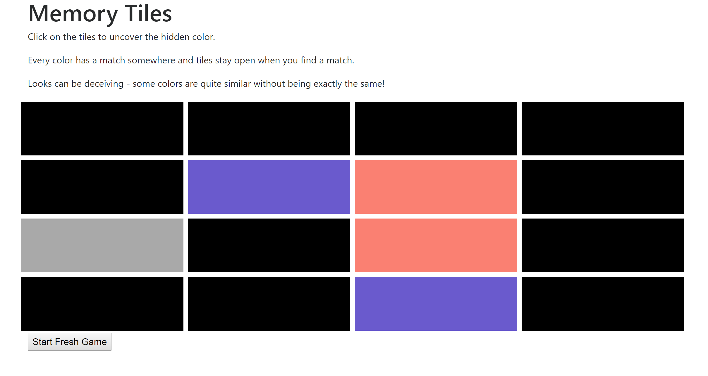

# Memory Tiles

Play current version: [Play Memory Tiles](http://htmlpreview.github.io/?https://github.com/priort/memory-tiles/blob/master/public/index.html)

## Screenshot of the game

This is a memory game implemented with F# and Fable. 
It displays a 4 X 4 grid of randomized colored tiles which are covered initially. The user selects 2 tiles in succession to uncover them. If the two selected tiles have the same hidden color, they are a match and they will stay open. If they do not match, they will be covered up again on the next valid tile selection (choosing an already matched tile or clicking a tile multiple times in succession just leaves the game board unchanged).
A freshly randomized grid can be generated at any time with the "Start Fresh Game" button.

This game has already been built with [MemoryTiles.fsx](./src/MemoryTiles.fsx) compiled into [bundle.js](./public/bundle.js) with Fable and Webpack. So the compiled game can be played by going to 
[Play Memory Tiles](http://htmlpreview.github.io/?https://github.com/priort/memory-tiles/blob/master/public/index.html)

Once the Fable Compiler and NPM are installed, to build the game, compile the f# source code in [MemoryTiles.fsx](./src/MemoryTiles.fsx)
by running this command from the root folder of this project
fable -m es2015 -w

This builds the fsx into Javascript using Fable and bundles it into bundle.js using webpack.
Then simple open [index.html](./public/index.html) in your browser
